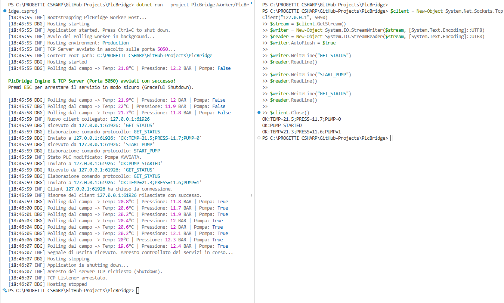
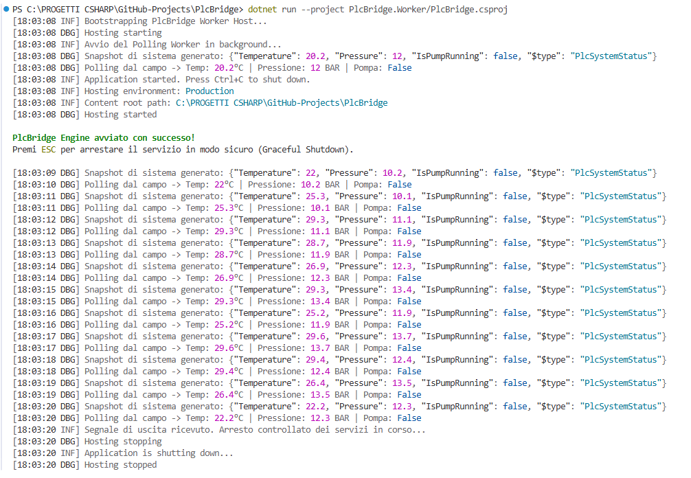
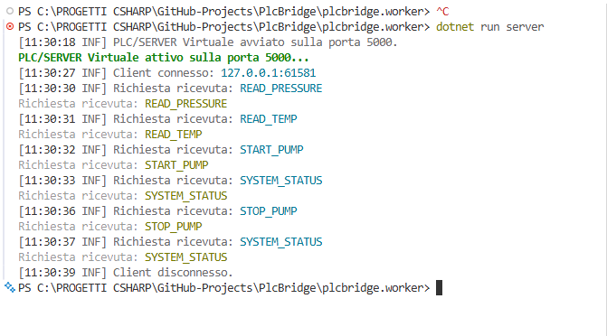
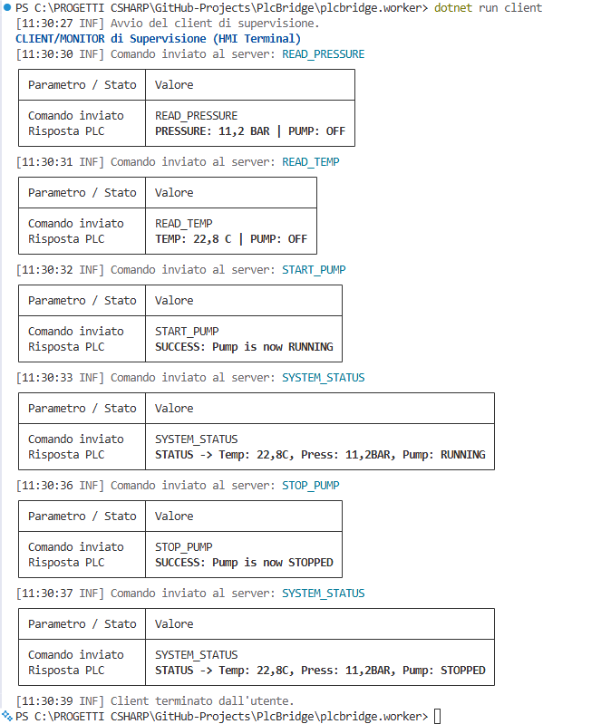

# PlcBridge

  

PlcBridge è uno strumento di studio e simulazione sviluppato per colmare la distanza tra software gestionale (.NET) e hardware industriale (PLC).

Nasce come banco di prova per la comunicazione TCP/IP e i modelli Request-Response in ambienti industriali, superando i limiti dei modelli a push continuo. È anche un banco di prova per pratiche di ingegneria del software moderne: Dependency Injection, Clean Architecture, .NET Generic Host e Test-Driven Development.

## ✨ Caratteristiche

- **Simulatore PLC Stateful e thread-safe:** memoria interna che simula temperatura, pressione e stato pompa di un vero PLC (`IPlcService` / `PlcSystemStatus`)
- **TCP Server per client esterni:** un `TcpListener` dedicato accetta connessioni concorrenti da client esterni (HMI, script, tool di test), esponendo gli stessi comandi del sistema tramite un protocollo testuale request-response, in parallelo al polling interno
- **Configurazione di rete esternalizzata:** indirizzo IP, host e porta non sono più cablati nel codice, ma centralizzati in `TcpSettings` e caricati da `appsettings.json` tramite il pattern nativo `IOptions<T>`
- **Polling interno automatico:** `BackgroundService` (`PlcPollingWorker`) che interroga il PLC su un thread separato dalla UI
- **Web HMI collegata via TCP/IP:** la Web HMI Blazor utilizza `NetworkPlcService` e comunica con il Worker esclusivamente tramite il protocollo TCP, senza accedere direttamente al `SimulatedPlcService`
- **Connessione persistente multi-comando:** la connessione TCP della HMI resta aperta per l'intera sessione, permettendo più comandi consecutivi senza riconnettersi a ogni operazione
- **Comandi di lettura:** `READ_PRESSURE` / `GET_STATUS`, `READ_TEMP`
- **Comandi di controllo attuatori:** `START_PUMP`, `STOP_PUMP`
- **Logging strutturato con Serilog:** console + file con rotazione giornaliera (retention 3 file)
- **Clean Architecture:** layer Core / Infrastructure / Worker / WebHmi / Tests disaccoppiati
- **.NET Generic Host:** DI nativa, configurazione centralizzata, gestione del ciclo di vita
- **Thread-Safety & Graceful Shutdown:** `lock` sui dati condivisi, `CancellationToken` per uno shutdown pulito (tasto **ESC**)
- **Test Unitari (xUnit):** validano `IPlcService` senza aprire porte di rete o socket
- **Integration Test TCP (xUnit):** verifica il flusso completo `TcpClient` → `TcpPlcServer` → `IPlcCommandProcessor` → `SimulatedPlcService` su loopback, usando una porta isolata configurata tramite `Options.Create(new TcpSettings { ... })`
- **CI/CD Ready:** pipeline GitHub Actions

## 🚀 Come iniziare

Il sistema è composto da due processi distinti che simulano un'architettura più vicina a uno scenario reale **HMI → Bridge → PLC**:

```text
┌─────────────────────────────┐
│           Web HMI           │
│       Blazor Server         │
│     NetworkPlcService       │
└──────────────┬──────────────┘
               │
               │ TCP/IP
               │ 127.0.0.1:5050
               ▼
┌─────────────────────────────┐
│       PlcBridge.Worker      │
│        TcpPlcServer         │
│       PlcPollingWorker      │
└──────────────┬──────────────┘
               │
               ▼
┌─────────────────────────────┐
│      SimulatedPlcService    │
│        Stato macchina       │
└─────────────────────────────┘
```

### Prerequisiti

- .NET 10 SDK
- Git
- Un browser moderno per la Web HMI

### 1. Clona la repository

```bash
git clone https://github.com/Mugen85/PlcBridge.git
cd PlcBridge
```

### 2. Configura la rete (opzionale)

Sia `PlcBridge.Worker` che `PlcBridge.WebHmi` includono un `appsettings.json` con la sezione `TcpSettings`:

```json
{
  "TcpSettings": {
    "BindAddress": "127.0.0.1",
    "Host": "127.0.0.1",
    "Port": 5050
  }
}
```

- Nel `Worker`, `BindAddress` è l'indirizzo su cui il `TcpPlcServer` resta in ascolto (`0.0.0.0` per accettare traffico da tutta la LAN).
- Nella `WebHmi`, `Host` e `Port` indicano dove `NetworkPlcService` deve connettersi.

Per cambiare ambiente (es. esporre il server sulla rete locale invece che solo in loopback) è sufficiente modificare questo file: non serve ricompilare né toccare il codice C#.

### 3. Avvia il server PlcBridge

Apri il **primo terminale** e avvia il Worker:

```bash
dotnet run --project PlcBridge.Worker/PlcBridge.csproj
```

Il Worker avvia automaticamente:

- il `SimulatedPlcService`, che mantiene lo stato della macchina;
- il `PlcPollingWorker`, che esegue il polling interno;
- il `TcpPlcServer`, che rimane in ascolto sull'indirizzo/porta letti da `TcpSettings` (default `127.0.0.1:5050`).

Il terminale del Worker deve **rimanere in esecuzione** mentre utilizzi la Web HMI.

### 4. Avvia la Web HMI

Apri un **secondo terminale**, senza chiudere il primo, e avvia la Web HMI:

```bash
dotnet run --project PlcBridge.WebHmi/PlcBridge.WebHmi.csproj
```

La Web HMI utilizza `NetworkPlcService`, che si collega al server TCP del PlcBridge sull'host e la porta configurati in `appsettings.json` (default):

```text
127.0.0.1:5050
```

Le operazioni della HMI vengono quindi inoltrate al Worker attraverso il bridge TCP:

```text
GET_STATUS
READ_TEMP
READ_PRESSURE
START_PUMP
STOP_PUMP
```

Dopo l'avvio, apri nel browser l'URL HTTPS indicato dalla console della Web HMI.

### 5. Ordine corretto di avvio

L'ordine di avvio è importante:

```text
Terminale 1
    │
    ▼
PlcBridge.Worker
    │
    ├── SimulatedPlcService
    ├── PlcPollingWorker
    └── TcpPlcServer (IOptions<TcpSettings>)
             │
             │ TCP/IP
             ▼
Terminale 2
    │
    ▼
PlcBridge.WebHmi
    │
    ▼
NetworkPlcService (IOptions<TcpSettings>)
    │
    ▼
TCP → PlcBridge
```

**Avvia sempre prima `PlcBridge.Worker` e successivamente `PlcBridge.WebHmi`.**

Se la Web HMI viene avviata prima del Worker, il server TCP non sarà disponibile. `NetworkPlcService` tenterà di stabilire la connessione quando verrà eseguita un'operazione sul servizio; in assenza del server verrà generato un errore di connessione.

### 6. Arresto del sistema

Per arrestare il Worker in modo pulito, utilizzare il normale meccanismo di shutdown dell'host e premere **ESC** quando previsto dalla TUI.

La Web HMI può essere terminata separatamente chiudendo il relativo processo/terminale.

### Test del TCP Server da un client esterno

È possibile verificare il bridge anche senza la Web HMI, ad esempio da PowerShell:

```powershell
$client = New-Object System.Net.Sockets.TcpClient("127.0.0.1", 5050)
$stream = $client.GetStream()
$writer = New-Object System.IO.StreamWriter($stream, [System.Text.Encoding]::UTF8)
$reader = New-Object System.IO.StreamReader($stream, [System.Text.Encoding]::UTF8)
$writer.AutoFlush = $true

$writer.WriteLine("GET_STATUS")
$reader.ReadLine()
```

### Esecuzione dei test

Dalla root della repository:

```bash
dotnet test PlcBridge.slnx
```

Oppure direttamente dal progetto di test:

```bash
dotnet test PlcBridge.Tests/PlcBridge.Tests.csproj
```

## ✅ Stato del Progetto

- [x] **Setup, TCP base, Version Control, CI/CD:** completati
- [x] **Stateful Server & Controllo Attuatori:** memoria di stato interna, `START_PUMP` / `STOP_PUMP`
- [x] **Refactoring DI e Clean Architecture:** layer Core / Infrastructure / Worker / Tests
- [x] **Connessione persistente multi-comando** su tutte le sessioni
- [x] **Logging con Serilog:** rotazione giornaliera e retention
- [x] **.NET Generic Host:** `BackgroundService` per il polling asincrono
- [x] **Thread-Safety & Graceful Shutdown:** `lock` + `CancellationToken`
- [x] **Raffinamento del contratto di dominio:** da modello a tag (`IPlcDriver`/`PlcTag`) a servizio tipizzato (`IPlcService`/`PlcSystemStatus`)
- [x] **TCP Server per client esterni:** `TcpListener` dedicato, testato con connessione multi-comando da client PowerShell
- [x] **Network Web HMI:** `NetworkPlcService` collega la Web HMI al PlcBridge tramite TCP/IP
- [x] **Configurazione esternalizzata:** `TcpSettings` + `appsettings.json` + `IOptions<T>`, nessun valore di rete cablato nel codice sorgente
- [x] **Quality Assurance:** suite xUnit riallineata a `IPlcService` + integration test TCP con `Options.Create`

## 🏗️ Architettura e Logica

### Clean Architecture

| Componente | Descrizione |
|---|---|
| **PlcBridge.Core** | Contratti (`IPlcService`), modelli immutabili (`PlcSystemStatus`) e la classe di configurazione `TcpSettings` (namespace `PlcBridge.Core.Models`). Nessuna dipendenza esterna. |
| **PlcBridge.Infrastructure** | `SimulatedPlcService`, `PlcCommandProcessor` e `TcpPlcServer`: implementazioni infrastrutturali dei contratti e del protocollo TCP. `TcpPlcServer` riceve `IOptions<TcpSettings>` invece di un valore di porta cablato. |
| **PlcBridge.Worker** | Host `.NET Generic Host`: DI, Serilog, `PlcPollingWorker` e servizi necessari al bridge; ospita il processo backend/PLC simulato. Registra `TcpSettings` da `appsettings.json` con `services.Configure<TcpSettings>(...)`. |
| **PlcBridge.WebHmi** | Applicazione Blazor Server. `NetworkPlcService` implementa `IPlcService`, legge `Host`/`Port` da `IOptions<TcpSettings>` e inoltra le operazioni al Worker tramite TCP/IP. |
| **PlcBridge.Tests** | Suite xUnit che valida `IPlcService` in isolamento e l'integrazione del TCP Server, mockando `TcpSettings` con `Options.Create(...)`. |

Il codice è diviso in layer con responsabilità separate. La Web HMI non accede direttamente all'implementazione del PLC simulato: il confine tra HMI e backend è il protocollo TCP/IP esposto dal PlcBridge.

### Due processi e un vero flusso HMI → Bridge → PLC

Il sistema separa chiaramente il processo backend dal processo HMI:

- `PlcBridge.Worker` ospita il `SimulatedPlcService`, il `PlcPollingWorker` e il `TcpPlcServer`;
- `PlcBridge.WebHmi` ospita la UI Blazor e `NetworkPlcService`;
- `NetworkPlcService` mantiene una connessione TCP persistente verso l'host/porta configurati in `TcpSettings`;
- le richieste provenienti dalla HMI vengono inoltrate al Worker tramite il protocollo request-response TCP;
- il Worker traduce i comandi ricevuti attraverso `PlcCommandProcessor` e li delega al servizio PLC simulato.

Il flusso applicativo è quindi:

```text
WebHmi
   │
   │ IPlcService
   ▼
NetworkPlcService (IOptions<TcpSettings>)
   │
   │ TCP/IP
   ▼
TcpPlcServer (IOptions<TcpSettings>)
   │
   ▼
PlcCommandProcessor
   │
   ▼
SimulatedPlcService
   │
   ▼
PlcSystemStatus
```

Questa separazione rende il comportamento più realistico rispetto a una HMI che accede direttamente al servizio PLC in memoria. Il server diventa infatti un vero endpoint di rete e, in futuro, il `SimulatedPlcService` può essere sostituito da un driver PLC reale senza dover modificare la HMI.

### Configurazione di rete centralizzata (`TcpSettings`)

Prima di questo refactoring, indirizzo e porta TCP erano valori cablati nel codice sorgente (nel costruttore di `TcpPlcServer` e in `NetworkPlcService`). Questo rendeva impossibile cambiare ambiente senza ricompilare, ed era un limite rispetto a uno standard enterprise.

La soluzione adottata sfrutta l'infrastruttura di configurazione nativa di .NET:

- **`TcpSettings.cs`** (`PlcBridge.Core.Models`): una POCO con `BindAddress`, `Host` e `Port`, che rappresenta il contratto di configurazione condiviso da server e client.
- **`appsettings.json`**: presente sia in `PlcBridge.Worker` che in `PlcBridge.WebHmi`, con i rispettivi `.csproj` configurati per copiare il file nell'output (`PreserveNewest`) ad ogni build.
- **`IOptions<TcpSettings>`**: nei rispettivi `Program.cs`, `services.Configure<TcpSettings>(configuration.GetSection("TcpSettings"))` collega la sezione JSON al binding automatico dell'oggetto.
- **`TcpPlcServer`**: non riceve più un `int port` nel costruttore, ma `IOptions<TcpSettings>`, da cui estrae `BindAddress` e `Port` per il binding del `TcpListener`.
- **`NetworkPlcService`**: allo stesso modo, legge `Host` e `Port` da `IOptions<TcpSettings>` invece di valori fissi nel codice.

Il risultato è che cambiare ambiente (es. da sviluppo locale a un'installazione in LAN) richiede solo la modifica di `appsettings.json`, senza toccare una riga di C#.

### Connessione TCP dalla Web HMI

`NetworkPlcService` implementa `IPlcService` mantenendo il contratto del Core indipendente dal protocollo di trasporto.

La classe:

- apre la connessione verso l'host/porta letti da `IOptions<TcpSettings>` quando necessario;
- riutilizza la connessione per più comandi consecutivi;
- usa `SemaphoreSlim` per serializzare le richieste sul socket condiviso;
- resetta il canale in caso di errore di comunicazione, consentendo una successiva riconnessione;
- interpreta le risposte testuali del server e le converte in `PlcSystemStatus` o valori tipizzati;
- propaga il `CancellationToken` alle operazioni asincrone di rete.

Questo mantiene la Web HMI indipendente dall'implementazione concreta del PLC.

### Dal modello a tag al servizio di dominio

La prima versione del Core esponeva un contratto generico a tag (`IPlcDriver`, `PlcTag`). È stato sostituito da `IPlcService`, che opera su un record immutabile (`PlcSystemStatus`) rappresentante l'intero stato macchina: un contratto più espressivo, tipizzato e meno soggetto a errori rispetto all'accesso per chiave stringa.

### Ciclo di vita e `CancellationToken`

Il Worker utilizza `CancellationToken` per governare polling e server TCP durante la chiusura dell'applicazione.

La Web HMI utilizza `CancellationToken` anche per le operazioni di rete attraverso `NetworkPlcService`, consentendo l'annullamento delle chiamate asincrone.

### Logging con Serilog

Console (`[HH:mm:ss LVL] Messaggio`) + file giornaliero (`logs/plcbridge-YYYYMMDD.txt`, retention 3 file), configurato centralmente nel layer Worker.

### Unit Testing con xUnit

`PlcBridge.Tests` valida `SimulatedPlcService` tramite `IPlcService`, senza rete né socket:

- `ConnectAsync_ShouldSetStateToConnected`
- `DisconnectAsync_ShouldSetStateToDisconnected`
- `ReadTagAsync_WhenNotConnected_ShouldThrowException`
- `ReadTagAsync_Pressure_ShouldReturnDoubleValue` (range 10.0–15.0 Bar)
- `WriteAndRead_PumpStatus_ShouldUpdateValue`

### Integration Testing del TCP Server

Oltre ai test unitari, la suite contiene `TcpServerIntegrationTests`, che verifica il comportamento del sistema attraverso il vero stack di comunicazione TCP.

Dato che `TcpPlcServer` non accetta più un intero a mano per la porta, il test costruisce le impostazioni al volo con `Options.Create(new TcpSettings { BindAddress = "127.0.0.1", Port = 50505 })`, mantenendo l'isolamento dalla configurazione reale.

Il test:

- avvia un'istanza reale di `TcpPlcServer` su una porta isolata (`50505`), configurata tramite `Options.Create`;
- apre una connessione reale tramite `TcpClient` verso `127.0.0.1`;
- invia il comando `START_PUMP`;
- legge la risposta dal socket;
- verifica che la risposta sia `OK:PUMP_STARTED`.

In questo modo viene verificata l'integrazione tra **TCP Server, command processor e servizio PLC simulato**, senza dipendere da un processo server esterno né da valori di configurazione cablati.

## 🐛 Troubleshooting Log

| # | Problema | Causa | Risoluzione |
|---|---|---|---|
| 1 | `CS0579` attributi duplicati in fase di split del progetto | Il Default Compile Globbing di MSBuild include anche i file `obj/` generati dagli altri progetti | Progetto principale spostato in una cartella dedicata (`PlcBridge.Worker`) |
| 2 | Progetto di test annidato nel progetto principale → altri `CS0579` | Struttura cartelle errata | Creata una `.sln` in root, `dotnet sln add`, test escluso dal progetto principale |
| 3 | `IOException` / `SocketException 10053` al secondo comando | `using` chiudeva il socket a ogni iterazione | Loop interno `while (client.Connected)` lato server |
| 4 | Crash Spectre.Console: `malformed markup tag` | Spazi nei tag passati a `AnsiConsole.MarkupLine` | Rimosso lo spazio o usato `Markup.Escape()` |
| 5 | `MSB3026`/`MSB3027`, file `.exe` bloccato | Due processi (`server`/`client`) bloccavano l'eseguibile su Windows | Architettura a processi separati per Worker e Web HMI |
| 6 | `CS0234`/`CS0246`, interfaccia non trovata nonostante `ProjectReference` corretto | File dell'interfaccia in Core creato senza estensione `.cs` | Aggiunta l'estensione mancante |
| 7 | Web HMI non raggiunge il PLC simulato direttamente | La HMI è stata separata dal processo Worker | Aggiunto `NetworkPlcService` per la comunicazione TCP/IP con il Worker |
| 8 | Test di integrazione TCP non più compilabili dopo il refactoring della configurazione | Il costruttore di `TcpPlcServer` non accetta più un `int port` ma `IOptions<TcpSettings>` | Aggiornati i test con `Options.Create(new TcpSettings { ... })` per mockare la configurazione su porta isolata |

## 💭 Riflessioni Tecniche

Il passaggio da script procedurali a .NET Generic Host ha mostrato la differenza tra codice che "funziona sul momento" e codice più robusto: la gestione della concorrenza (`lock`, `SemaphoreSlim`) e la cancellazione (`CancellationToken`) sono fondamentali quando più componenti accedono allo stesso stato attraverso canali distinti.

L'introduzione di `NetworkPlcService` ha aggiunto un vero confine di rete tra Web HMI e backend. La HMI non accede più direttamente al simulatore: comunica attraverso il protocollo TCP/IP, mantenendo `IPlcService` come contratto astratto del Core.

L'eliminazione dei valori di rete cablati tramite `TcpSettings` e `IOptions<T>` ha chiuso un altro debito tecnico tipico dei progetti "da laboratorio": un indirizzo o una porta scritti direttamente nel codice sono innocui in una demo locale, ma diventano un problema reale nel momento in cui l'applicazione deve girare su ambienti diversi (sviluppo, collaudo, produzione) senza essere ricompilata. Il pattern `IOptions<T>` è lo standard con cui .NET risolve questo problema, ed è lo stesso approccio usato in applicazioni enterprise di produzione.

Il sistema rappresenta ora un flusso più realistico:

```text
HMI
 ↓
Network TCP Client (IOptions<TcpSettings>)
 ↓
PlcBridge TCP Server (IOptions<TcpSettings>)
 ↓
Command Processor
 ↓
PLC Service
 ↓
PLC / Simulatore
```

Questo permette di sostituire in futuro il `SimulatedPlcService` con un driver PLC reale senza coinvolgere la Web HMI e senza modificare il contratto di dominio.

Il refactoring da `IPlcDriver`/`PlcTag` a `IPlcService`/`PlcSystemStatus` ha rafforzato il principio cardine della Clean Architecture: le interfacce permettono di sostituire la tecnologia sottostante (oggi un simulatore, domani un driver `S7Net`, Modbus o altro) senza toccare la logica applicativa.

## 🛠️ Tech Stack

- C# / .NET 10
- Clean Architecture (Core, Infrastructure, Worker, WebHmi)
- .NET Generic Host & `BackgroundService`
- Configurazione esterna (`appsettings.json`, `IOptions<T>`)
- TCP/IP Sockets (`TcpListener` multi-client + `TcpClient`)
- Blazor Server / Razor Components
- Spectre.Console (TUI)
- Dependency Injection / Inversion of Control
- xUnit (Unit & Integration Testing)
- Serilog
- GitHub Actions (CI/CD)

## 🖼️ Screenshot

**ULTIMA VERSIONE — TCP Server esterno (porta 5050) con connessione client di prova (PowerShell):**



**Worker — avvio con .NET Generic Host, polling in background e Graceful Shutdown:**



*(Screenshot di versioni precedenti)*

**Server — sessione su connessione persistente:**



**Client — TUI di supervisione:**



---

*Progetto sviluppato come parte del percorso di crescita professionale nel settore Industrial Software Engineering.*