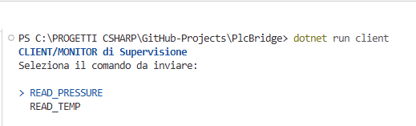
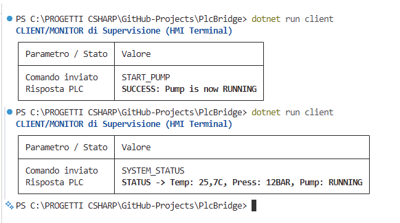
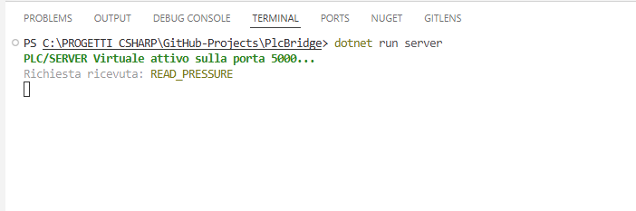

# PlcBridge


PlcBridge è uno strumento di studio e simulazione sviluppato per colmare la distanza tra software gestionale (.NET) e hardware industriale (PLC).

Questo progetto nasce come banco di prova per testare la comunicazione TCP/IP e implementare modelli di interazione Request-Response in ambienti industriali, superando i limiti dei modelli a push continuo. È inoltre un banco di prova per pratiche di ingegneria del software moderne: Dependency Injection, Inversion of Control e Test-Driven Development.

## ✨ Caratteristiche

- **Simulatore Server/PLC Stateful:** gestione asincrona delle connessioni sulla porta 5000, con memoria interna che simula i registri di un vero PLC
- **Connessione persistente Client-Server:** una singola connessione TCP rimane attiva per l'intera sessione, permettendo l'invio di più comandi consecutivi senza riconnettersi
- **Logging strutturato con Serilog:** eventi tracciati su console e su file, con rotazione giornaliera e pulizia automatica dei log più vecchi (retention di 3 file)
- **Client di Monitoraggio:** interfaccia a TUI (Terminal User Interface) con Spectre.Console per interrogare e controllare lo stato della macchina in modo leggibile e strutturato, con menu ciclico per richieste multiple e uscita esplicita (`ESCI`)
- **Comandi di lettura:** `READ_PRESSURE`, `READ_TEMP`, `SYSTEM_STATUS`
- **Comandi di controllo attuatori:** `START_PUMP`, `STOP_PUMP` per l'interazione bidirezionale tipica di una vera HMI
- **Protocollo Polling:** implementazione di una logica Master-Slave per la richiesta e l'invio dati
- **Architettura disaccoppiata:** logica del PLC astratta dietro l'interfaccia `IPlcController` e iniettata via costruttore (Dependency Injection)
- **Test Unitari:** suite xUnit che verifica ogni comando del PLC senza dover aprire porte di rete o socket
- **CI/CD Ready:** pipeline GitHub Actions integrata per la validazione automatica del codice ad ogni modifica

## 🚀 Come iniziare

1. Clona la repository:
   ```
   git clone https://github.com/Mugen85/PlcBridge.git
   ```
2. Apri il terminale nella cartella del progetto.
3. Avvia il Server:
   ```
   dotnet run server
   ```
4. Avvia il Client (in un altro terminale):
   ```
   dotnet run client
   ```
5. Esegui la suite di test:
   ```
   dotnet test
   ```

## ✅ Stato del Progetto

- [x] **Setup Ambiente:** Completato (struttura organizzata in GitHub Projects)
- [x] **Implementazione TCP Base:** Socket TCP/IP funzionanti
- [x] **Implementazione Polling:** Sistema Request/Response (Client/Server) configurato
- [x] **CI/CD Pipeline:** `dotnet.yml` su GitHub Actions — stato **Green** (build superata)
- [x] **Version Control:** Repository Git collegata correttamente al remoto GitHub
- [x] **UI Engineering:** Implementazione TUI (Terminal User Interface) con Spectre.Console
- [x] **Stateful Server & Controllo Attuatori:** memoria di stato interna e comandi di scrittura (`START_PUMP`, `STOP_PUMP`)
- [x] **Refactoring Dependency Injection:** introduzione di `IPlcController` e Inversion of Control
- [x] **Quality Assurance:** suite di Test Unitari (xUnit) configurata e funzionante
- [x] **Connessione persistente multi-comando:** client e server mantengono la connessione aperta per l'intera sessione, con loop di lettura/scrittura su entrambi i lati
- [x] **Logging con Serilog:** tracciamento eventi su console e file, con rotazione giornaliera e retention automatica dei log più vecchi

## 🏗️ Architettura e Logica

### Il ciclo di vita del processo

I programmi server occupano il socket finché non vengono terminati correttamente. La gestione delle risorse di sistema (es. `taskkill /F /IM PlcBridge.exe`) è fondamentale: se il processo resta "appeso", la porta 5000 rimane occupata e impedisce nuove esecuzioni.

### Protocollo Request-Response

Il progetto ha superato il modello a "push continuo" (il server invia dati a prescindere) in favore del modello a **Polling**:

1. Il **Client** richiede un dato specifico (es. `READ_PRESSURE`)
2. Il **Server** valuta la richiesta
3. Solo se valida, il Server risponde

Questo è il cuore di ogni comunicazione Master-Slave nell'automazione industriale.

### Connessione persistente e sessione multi-comando

La prima implementazione apriva e chiudeva una connessione TCP per ogni singolo comando: client e server si scambiavano un messaggio, poi lo `stream` veniva rilasciato (`using` a fine iterazione del loop). Questo andava bene per un comando isolato, ma non permetteva una vera sessione di monitoraggio continuo.

Il refactoring introduce un **loop di comunicazione su entrambi i lati**:

- Il **Client** stabilisce la connessione una sola volta, poi resta in un ciclo che ripropone il menu dopo ogni risposta, finché l'operatore non seleziona esplicitamente `ESCI`.
- Il **Server**, per ogni client accettato, entra in un ciclo interno che continua a leggere comandi sulla stessa connessione finché non riceve un segnale di chiusura pulita (`bytesRead == 0`) o un'eccezione di rete (`IOException`), gestita senza terminare il processo server.

Questo modello riflette meglio una vera sessione HMI-PLC, dove l'operatore invia più richieste consecutive senza dover ristabilire il collegamento ogni volta.

### Logging strutturato e rotazione dei log con Serilog

Sia il server che il client scrivono i propri eventi tramite **Serilog**, con due destinazioni (sink) configurate contemporaneamente:

- **Console:** output leggibile a runtime, con timestamp e livello di log in formato compatto (`[HH:mm:ss LVL] Messaggio`).
- **File:** un file di log per giorno (`logs/plcbridge-YYYYMMDD.txt`), grazie a `RollingInterval.Day`.

Per evitare che la cartella `logs/` cresca indefinitamente nel tempo, è impostato un **limite di retention**:

```csharp
.WriteTo.File(
    "logs/plcbridge-.txt",
    rollingInterval: RollingInterval.Day,
    retainedFileCountLimit: 3 // Mantiene solo gli ultimi 3 file
)
```

- Ad ogni nuovo giorno, Serilog crea un nuovo file di log.
- Quando il numero di file supera il limite impostato (3), i file **più vecchi vengono eliminati automaticamente** ad ogni avvio dell'applicazione — non serve alcuna pulizia manuale.
- Questo bilancia due esigenze tipiche in ambito industriale: avere uno storico sufficiente per il debug retrospettivo (es. "cosa è successo ieri quando la pompa si è fermata"), senza che i log occupino spazio disco indefinitamente.

**Nota:** il limite si applica al numero di *file*, non ai singoli eventi di log al loro interno — con `RollingInterval.Day` corrisponde quindi a circa 3 giorni di storico. Se in futuro serve una retention diversa (es. per requisiti di audit più stringenti), basta modificare il valore di `retainedFileCountLimit` o passare a un `rollingInterval` differente (es. `Hour` per rotazioni più frequenti).

### Evoluzione visuale: verso una TUI con Spectre.Console

Per migliorare l'usabilità dello strumento senza passare subito alla complessità del Web (Blazor), è stato introdotto **Spectre.Console**:

- **Motivazione:** le interfacce a riga di comando (CLI) sono standard nell'automazione, ma le tabelle e i colori di Spectre permettono di creare una "dashboard" leggibile istantaneamente dall'operatore.
- **Lezione:** separare la logica di comunicazione (Socket) dalla logica di presentazione (TUI) rende il codice più manutenibile e professionale.

### Stato del server e comandi di scrittura (controllo attuatori)

Per rendere il simulatore un vero sistema industriale, sono stati introdotti due concetti cruciali:

1. **Memoria di Stato (Stateful Server):** il server mantiene variabili globali (`isPumpRunning`, `currentPressure`) che simulano i registri interni di un PLC. Non si limita più a rispondere con dati estemporanei, ma tiene traccia dello stato degli attuatori.
2. **Comandi di Scrittura / Controllo:** oltre alle letture passive (`READ_TEMP`, `READ_PRESSURE`), sono stati aggiunti comandi attivi come `START_PUMP`, `STOP_PUMP` e `SYSTEM_STATUS`. Questo simula l'interazione bidirezionale tipica di una vera HMI (accensione/spegnimento di macchinari).

### Refactoring architetturale: Dependency Injection & Inversion of Control

Per rendere il software pronto per il web (Blazor) e per protocolli di automazione professionali (OPC UA), è stato introdotto un refactoring architetturale:

- **`IPlcController` (interfaccia):** definisce il contratto del PLC (`Start`, `Stop`, `Read`), disaccoppiando la logica di business dall'implementazione concreta.
- **Inversion of Control:** il Server non crea più il PLC al proprio interno, ma lo riceve tramite il costruttore.
- **Vantaggio:** la logica di business è ora isolata e testabile in modo indipendente, senza dover aprire porte di rete o socket reali.

### Qualità: Unit Testing con xUnit

È stata aggiunta una suite di test che verifica ogni comando del PLC. Il codice non è più scritto "a vista", ma guidato dai test: se il test passa, la funzionalità è garantita. Grazie al disaccoppiamento introdotto con `IPlcController`, i test possono validare la logica di business isolatamente, senza dipendere dallo stack di rete.

### Componenti

| Componente | Descrizione |
|---|---|
| **Server** | Ascolta su `IPAddress.Any` (qualsiasi interfaccia di rete) sulla porta 5000, gestisce i comandi in entrata (lettura e scrittura) tramite un `IPlcController` iniettato, mantiene lo stato interno degli attuatori e gestisce più comandi per connessione in un ciclo persistente |
| **Client** | Si connette una sola volta e resta in sessione: invia comandi stringa in loop, attende la risposta bufferizzata con gestione sicura dei tipi (`?? string.Empty`) e visualizza i dati tramite `AnsiConsole` (tabelle formattate e `SelectionPrompt` per input a prova di errore), fino a uscita esplicita (`ESCI`) |
| **PlcBridge.Tests** | Progetto di test xUnit separato, che valida ogni comando del PLC tramite `IPlcController` senza dipendenze di rete |

## 🐛 Troubleshooting Log

Lezioni raccolte durante lo sviluppo, utili come riferimento futuro.

### 1. Errore di file bloccato (MSB3026)
- **Problema:** il compilatore falliva perché l'eseguibile era in uso.
- **Causa:** il server (`PlcBridge.exe`) era ancora attivo in background.
- **Risoluzione:** `taskkill /F /IM PlcBridge.exe`, o preferibilmente terminazione corretta con `Ctrl+C`.

### 2. Errori di compilazione C# (CS8803, CS1022, CS0260)
- **Problema:** errori su "missing partial modifier" o "top-level statements".
- **Causa:** parentesi graffe `}` fuori posto, che rompevano la struttura della classe.
- **Risoluzione:** revisione gerarchica delle parentesi: la classe deve contenere tutto il codice.

### 3. Git: "remote origin already exists"
- **Problema:** impossibilità di aggiungere il remote durante la configurazione iniziale.
- **Risoluzione:** `git remote set-url origin [URL]` sovrascrive il collegamento esistente in modo pulito.

### 4. Gestione input nullo
- **Problema:** warning del compilatore su possibili input nulli.
- **Risoluzione:** utilizzo dell'operatore `?? string.Empty` per garantire sicurezza di tipo.

### 5. Configurazione CI/CD (GitHub Actions)
- **Problema:** incertezza sulla struttura delle cartelle.
- **Risoluzione:** percorso esatto `.github/workflows/dotnet.yml`. Semaforo verde = codice validato.

### 6. Installazione pacchetti NuGet
- **Problema:** necessità di utilizzare librerie esterne (Spectre.Console).
- **Risoluzione:** utilizzo del comando `dotnet add package Spectre.Console`. Fondamentale assicurarsi di essere nella cartella corretta (file `.csproj`) prima di eseguire il comando.

### 7. Problemi di annidamento progetti (nesting issues)
- **Problema:** il progetto di test era stato creato dentro la cartella del progetto principale, causando errori `CS0579` (attributi duplicati) e conflitti di Assembly.
- **Risoluzione:**
  - Creazione di una Solution (`.sln`) nella radice del repository.
  - Utilizzo di `dotnet sln add [progetto]` per gestire i due progetti come entità separate.
  - Esclusione esplicita della cartella di test dal progetto principale nel `.csproj`, per evitare la cross-compilazione.

### 8. Errore "Non sono stati trovati progetti" durante `dotnet add reference`
- **Problema:** il comando cercava una cartella, ma doveva puntare al file `.csproj` specifico.
- **Risoluzione:** `dotnet add PlcBridge.Tests/PlcBridge.Tests.csproj reference PlcBridge.csproj`.

### 9. Connessione interrotta al secondo comando (`IOException` / `SocketException 10053`)
- **Problema:** il client si disconnetteva con un'eccezione fatale non appena si tentava di inviare un secondo comando nella stessa sessione.
- **Causa:** il server apriva la connessione con `using TcpClient`/`using NetworkStream` **dentro** il loop `while (true)` di accettazione, gestendo un solo comando per connessione. Al termine dell'iterazione, gli `using` chiudevano automaticamente il socket, mentre il client presumeva la connessione ancora attiva.
- **Risoluzione:** aggiunto un ciclo interno lato server (`while (client.Connected)`) che continua a leggere/rispondere sulla stessa connessione finché il client non la chiude esplicitamente (`bytesRead == 0`) o si disconnette bruscamente (gestito con `catch (IOException)` senza terminare il processo server).

## 💭 Riflessioni Tecniche

La configurazione di una pipeline CI/CD ha chiarito che il software non è solo "scrivere codice", ma creare un processo: avere un test automatico su GitHub garantisce che, anche a distanza, un'eventuale modifica che "rompe" qualcosa venga segnalata immediatamente.

La gestione del "remote already exists" in Git ha insegnato che i messaggi d'errore non vanno temuti, ma letti come indicazioni stradali: Git non vuole creare duplicati, vuole solo sapere quale sia la strada corretta da seguire.

L'adozione di Spectre.Console ha trasformato il Client da un semplice script di test a uno strumento di supervisione vero e proprio, dimostrando che l'usabilità conta quanto la funzionalità.

La gestione della struttura Solution (`.sln`) ha insegnato quanto sia critica la configurazione ambientale: un progetto ben organizzato non è solo più leggibile, è anche più facile da compilare e testare.

Il refactoring verso `IPlcController` e la Dependency Injection ha segnato il passaggio da un semplice script funzionante a un'architettura pensata per l'evoluzione: separare "cosa fa" il PLC da "come lo fa" apre la strada a nuove implementazioni (OPC UA, interfacce web) senza toccare la logica di business già testata. Il "motore" è ora pronto per essere loggato professionalmente con Serilog.

Il passaggio da connessioni "usa e getta" a una sessione persistente ha chiarito una distinzione fondamentale nella programmazione di rete: la differenza tra "un protocollo che risponde a un comando" e "un protocollo che sostiene una conversazione". Il secondo richiede di pensare esplicitamente al ciclo di vita della connessione su entrambi i lati, non solo alla singola transazione.

## 🛠️ Tech Stack

- C# / .NET 10
- TCP/IP Sockets
- Spectre.Console (TUI)
- Dependency Injection / Inversion of Control
- xUnit (Unit Testing)
- GitHub Actions (CI/CD)

## 🖼️ Screenshot

**Client — avvio pompa e system status:**



**Client — riepilogo comandi e risposte:**



**Server — ricezione comando e attuazione:**



---

*Progetto sviluppato come parte del percorso di crescita professionale nel settore Industrial Software Engineering.*